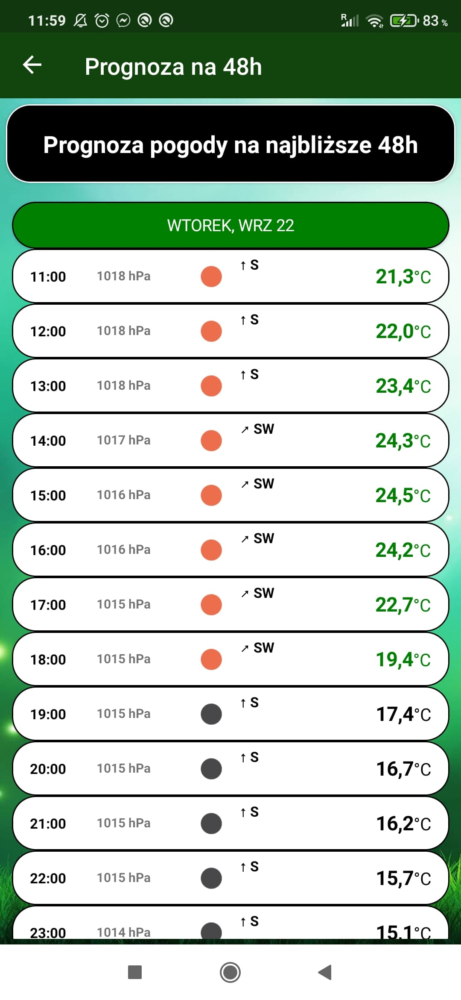

# MyWeatherApp
Aplikacja pogody przedstawia aktualne dane pogodowe dla danej lokalizacji, przewidywania na siedem kolejnych dni oraz przewidywania godzinowe na 48h. Po kliknięciu w określony dzień na liście uruchamiany jest popup ze szczegłówymi informacjami.
<<<<<<< HEAD
Aplikacja napisana zgodnie z wzorcem MVVM.
=======
Aplikacja napisana zgodnie z wzorcem MVVM. Wykorzystuje OpenWatherMap API, dlatego dodano obsługę HTTP.
>>>>>>> be34081bceddfe67b1c60177104fac1ef053ee9f
## Technologie
* Xamarin.Forms 4.6
* C#
### Pakiety(pluginy)
* Newtonsoft 12.0.3
* Rg.Plugins.Popup 2.0.0.5
* Xamarin.Essentials 1.5.3.2
* Xamarin.FFImageLoading 2.4.11.982
* Xamarin.FFImageLoading.Forms 2.4.11.982
### OpenWeatherMap API
Skorzystano z darmowego API do pobierania danych pogodowych
https://openweathermap.org/guide

Darmowe ikony pobierano ze strony:
https://www.flaticon.com/

### Screenshots

